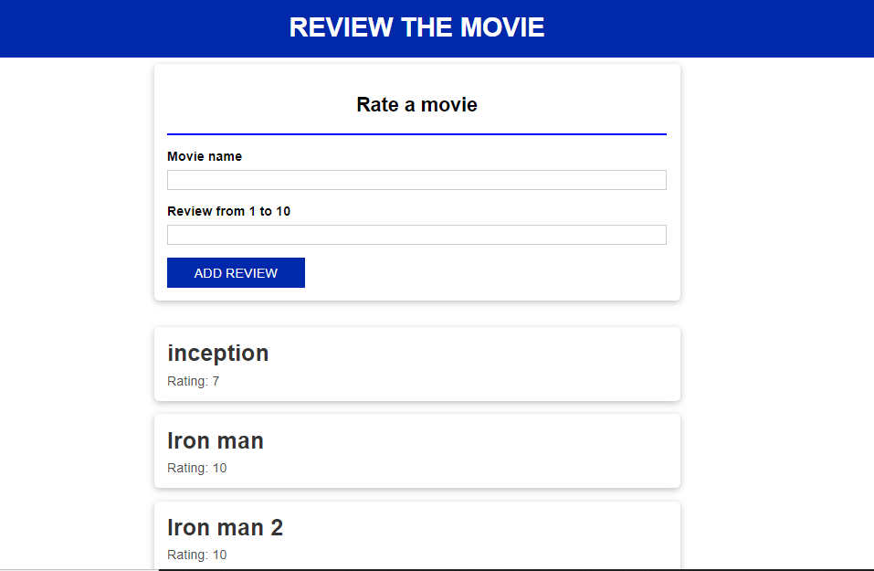

# Welcome to Movie Rating System!

Hi! 
In this simple project I have tried to implement my **Node.js** and **React.js** knowledge. This is a very simple app which has two sub folders i.e. Frontend and the Backend. In the frontend folder you will get the React components and In the backend folder you will have node modules.


# Important steps

 - Clone the repositry to your directory using 
 ```
 git clone https://github.com/priyanshudubey/Movie-rating-with-node-and-react.git`
 ```
 - Then move to the **frontend** directory and type the following command:
	 ```
	 npm install
	 npm start
	```
	
 - Do the same above step by going to the **backend** folder as well.

## Snapshot of the app

